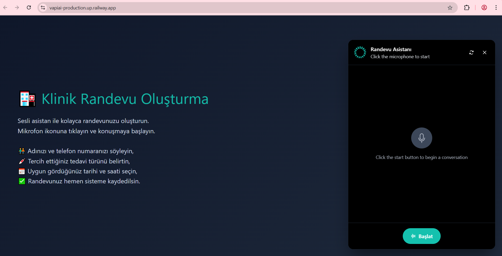
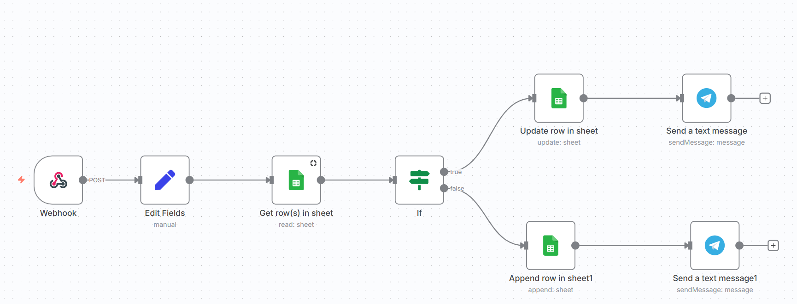

n8n ve Vapi AI kullanarak bir sesli asistan oluşturdum. Bu asistan ile sesli konuşarak google sheets'e kullanıcı kaydı yaptırılabiliyor. Öncelikle n8n de workflow tasarlandıktan sonra , n8n'i Railway kullanarak deploy ettim. Arayüzümü basit bir şekilde visual code üzerinden html/css kullanarak tasarladım ve bu arayüzü de aynı şekilde Railway kullanarak deploy ettim. Bu şekilde n8n ile arayüzüm arasında bağlantı kurdum. Aynı zamanda bu şekilde projemi de belirli bir süre public olarak internetten ulaşılabilir kıldım (Railway deneme süresi boyunca). Workflow sonunda eklediğim telegram uygulaması ile de kullanıcı ismi güncellendiğinde veya yeni kullanıcı eklendiğinde mesaj gelmesini sağladım.

Vapi AI üzerinde bulunan asistanı kendi widgetini kullanarak siteye entegre ettim. 

  

